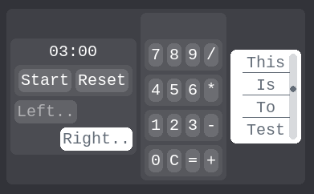

MiniUI is a minimal UI engine built with `pygame`, designed to make surfaces interactive with minimal boilerplate. 
It gives your custom scripts a simple imperative retained UI layer without needing to worry about hit detection.



# Features
- Easy-to-extend UI elements
- Stack- and box-based layout containers
- Recursive layout sizing
- Cached drawing by default with dirty flags
- Optional scene management system ("Stages")
- Async-safe callbacks (main thread execution)
- First-hit event dispatching
- Partial rich text support
- Subscribe/unsubscribe event listeners

# Creating Custom Elements

Derive from `UIElement`, and override just two methods:

```
class Custom(UIElement):
    def measure(self) -> tuple[int, int]:
        return (width, height)

    def draw_surf(self) -> pygame.Surface:
        return your_surface
```

You now have a usable element that can also override any of the 12 optional interaction callbacks:

```
def on_click(self, relative_mouse_pos): pass
def on_down(self, relative_mouse_pos): pass
def on_up(self): pass
def on_enter(self): pass
def on_exit(self): pass
def on_scroll(self, up, down): pass
def on_right(self) -> list[tuple[str, Callable]]: pass
def on_keystroke(self, event): pass
def on_kb_focus(self): pass
def on_kb_defocus(self): pass
def while_clicked(self, relative_mouse_pos): pass
def while_hovered(self, relative_mouse_pos): pass
```

All UI state is tracked in the `istate` object attached to each `UIElement`, accessible for rendering conditional visuals.

# Layout System

MiniUI uses composable containers:
- StackLayout: elements self-place within the container
- BoxLayout: elements auto-align vertically or horizontally

All containers are themselves UI elements and can be freely nested.
Layouts are recalculated recursively when a reflow is triggered or the screen size changes. 
By default, elements draw centered in their layout cell.

#### Example: Nested Input Dialog

```
class Offset(ui.core.Stage):
    def start(self):
        self.back = Button(UII, "<- Back", self.clickon_back)\
            .place(Alignment.TOP_LEFT, offset=[Style.PADDING.LAYOUT_PADDING]*2)

        self.root = UIContainer(UII, BoxLayout("vertical")).add_elements({
            "start": UIContainer(UII, BoxLayout("horizontal")).add_elements({
                "label": TextLabel(UII, "Start: "),
                "ebox": EntryBox(UII, "YYYY-MM-DD"),
            }),
            "end": UIContainer(UII, BoxLayout("horizontal")).add_elements({
                "label": TextLabel(UII, "End: "),
                "ebox": EntryBox(UII, "YYYY-MM-DD"),
            }),
            "amount": UIContainer(UII, BoxLayout("horizontal")).add_elements({
                "label": TextLabel(UII, "GB: "),
                "ebox": EntryBox(UII),
            }),
            "buttons": UIContainer(UII, BoxLayout("horizontal")).add_elements({
                "date_ez": Button(UII, "Smart fill", self.clickon_fill),
                "go": Button(UII, "Add!", self.clickon_go),
            }),
        })
        UIEngine.add({"back": self.back, "main": self.root})
```


# Optional: Scene Management via Stage

MiniUI provides an optional scene system based on a stack-driven state machine. Each `Stage` has lifecycle methods:

```
class Stage:
    def start(self): pass
    def handle_events(self, events): return events
    def update(self, dt): pass
    def pause(self): pass
    def resume(self): pass
    def cleanup(self): pass
```

Use `StageManager.transfer_stage()`, `.switch_stage()`, and `.return_stage()` to navigate between screens. This isolates logic between scenes without deep nesting or global state.

Or not - you can just choose to init the engine and tick it yourself in your own custom code!